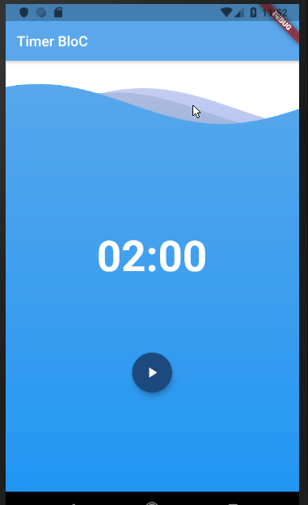
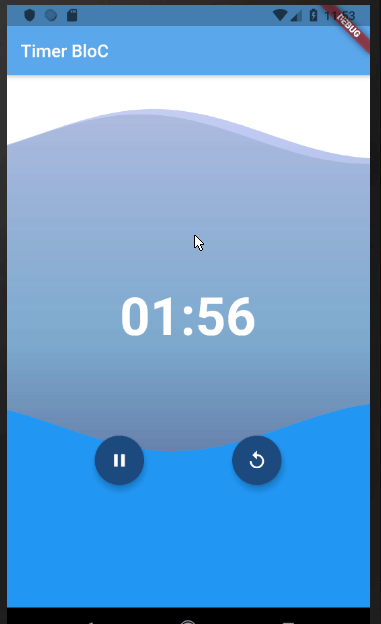

# bloc_timer 
I following this to build timer by using BloC pattern in flutter ♥ ♥ 

#### What i did ❓ 
- separate all in classes 📒 
- make wave move when seconds down 🔻 

#### screenshot 📺 📺 
 
 

